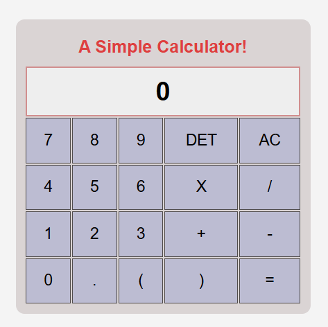

# 🧮 A Simple Calculator

A simple calculator built using **HTML**, **CSS**, and **JavaScript**.  
It supports basic arithmetic operations, parentheses, delete (DET), and clear (AC).

---

## 📸 UI Preview
 

---

## 🚀 Features
- Addition ➕  
- Subtraction ➖  
- Multiplication ✖️  
- Division ➗  
- Parentheses support `( )`  
- Delete last entry (DET)  
- All Clear (AC)  

---
## Folder Structure

```plaintext
📁 calculator
├── index.html # Main HTML structure
├── style.css # Styling for calculator
├── javascript.js # Functionality (logic)
└── README.md # Project documentation
``` 
---

## ⚡ How to Run
1. Clone or download this repository.  
2. Open `index.html` in your browser.  
3. Start calculating! 🎉  

---

## 🛠️ Code Overview
- **HTML** → Creates calculator UI with a table layout.  
- **CSS** → Styles the calculator, display, and buttons.  
- **JavaScript** → Handles user input, operations, and evaluation with `eval()`.  

---

## 📌 Example
- Input: `(7+3)*2`  
- Output: `20`

---

## 🌐 Live Demo
👉 [Click Here](https://rony7s.github.io/Calculator/)
---

## 🤝 Contributing
Feel free to fork this repo and enhance the calculator by adding:  
- Keyboard support ⌨️  
- Scientific operations (√, %, ^)  
- Dark/Light theme 🌗  

---

## 📄 License
This project is **open-source** and free to use.

---

## 📬 Contact
For any questions or suggestions, please reach out!  

- 👤 Rony Ahmmed  
- 🌐 GitHub: [@Rony7s](https://github.com/Rony7s)  
- 📧 Email: **bdu.rony@gmail.com**

